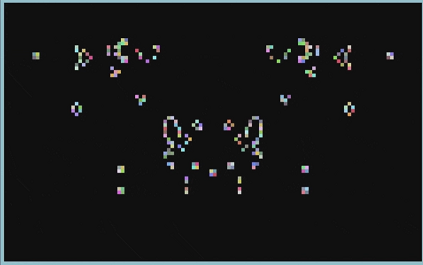
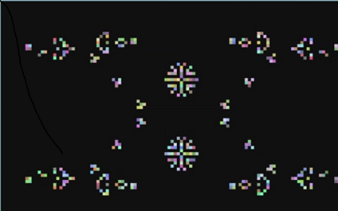
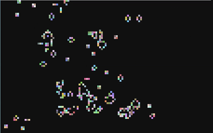
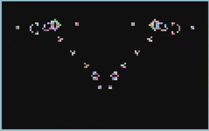

In this project, Conwey's game of life is implemented.   
In this, for every p greater than or equal to 14, it is possible to construct a glider gun in which     
the gliders are emitted with period p. [Bill Gosper](https://en.wikipedia.org/wiki/Bill_Gosper) discovered the first glider gun in 1970, earning prize from Conway.    

The frontend of the notebook **game_of_live.ipynb** (see version 120x100)    
has the following interface:   

* Enter - start the game
* Esc   - escape from the game 
* Space - stop and clear (generations counter is reset (in red))
* p     - pause the game
* f     - read the game initial position (opens the file dialog)
* w     - save the  game initial position to the file 
* click - create the cell in the current location
* right click - remove the cell in the current location 

          
    

### Three videos created using this code

[Two streams of gliders in a crossed flight](https://www.youtube.com/watch?v=7PJ4_8lKbTQ)      
[Four streams of gliders](https://www.youtube.com/watch?v=G1je5jT7cEc)    
[Grosper gliders](https://www.youtube.com/watch?v=ZG0LpOL26QI)     

### References

[Conway's Game of Life](https://en.wikipedia.org/wiki/Conway%27s_Game_of_Life)    
[Cellular automaton](https://en.wikipedia.org/wiki/Cellular_automaton)    
[epic conway's game of life](https://www.youtube.com/watch?v=C2vgICfQawE)    
[Game of Life News](http://pentadecathlon.com/lifeNews/index.php)   
[Program for Conway’s Game Of Life](https://www.geeksforgeeks.org/program-for-conways-game-of-life/)    

### Credit

The code is based on Chris Careaga's code https://github.com/CCareaga/Pygame-Examples/tree/master/Game%20Of%20Life

