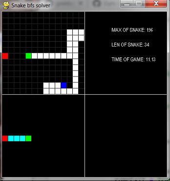
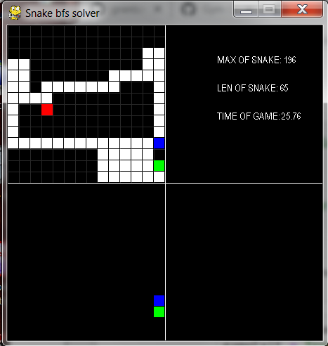
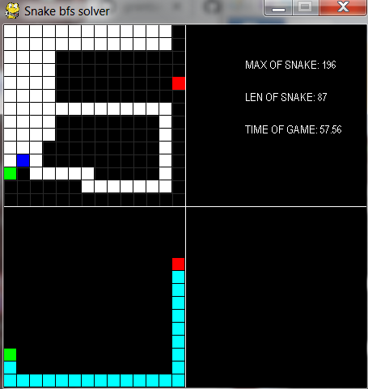
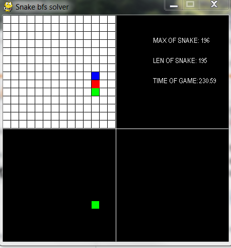

     
 

### Snake with Deep-Q-Network

For the Snake trained with Deep Reinforcement Learning algorithm DQN see [here](https://github.com/Rafael1s/Deep-Reinforcement-Learning-Udacity/tree/master/Snake-Pygame-DQN).

### Video
See video [Artificial snake on the way](https://www.youtube.com/watch?v=-jNfUrVniNg&t=2s) on youtube.

### Credit
Most of the code is based on Guangyang Li's code https://github.com/DC-Data/SnakeSolver/blob/master/snake.py
